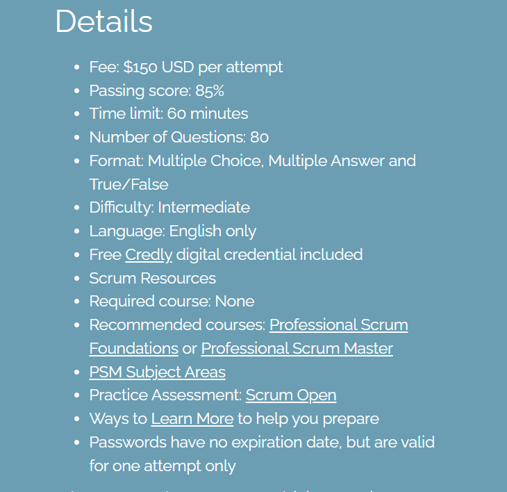

[Professional Scrum Master დონე I](https://www.scrum.org/professional-scrum-master-i-certification) (PSM I) - განკუთვნილია ყველასთვის, ვისაც სურს დაადასტუროს `Scrum` სამუშაო ჩარჩოს ზოგადი ცოდნა, სერთიფიკატი მოწოდებულია [Scrum.org-ის](https://www.scrum.org/) მიერ და არ გააჩნია მოქმედების ვადა, ტესტირების დროს შეგიძლიათ გამოიყენოთ ჩანაწერები, [Scrum Guide](https://scrumguides.org/scrum-guide.html) და სხვა რესურსი, მაგრამ შეზღუდული დროის გამო, უმჯობესია ყურადღება გავამახვილოთ გამოცდაზე. ტესტირება მიმდინარეობს 60 წუთის განმავლობაში და შეიცავს 80 კითხვას, ბარიერი არის 85%. გამოცდა ტარდება დისტანციურად, ვებ-საიტზე. სერთიფიკატი არ მოითხოვს წინაპირობას, განსხვავებით სხვა პროვაიდერების მიერ მოწოდებული სერთიფიკატებისგან, რომლებიც მათი მოსამზადებელი, ძვირადღირებული კურსის გავლას ითხოვენ.

გამოცდისთვის მომზადებისას პირველ რიგში გაეცანით `Scrum Guide`-ს, რომელიც დღეის მდგომარეობით 14 გვერდიანია, ასევე არსებობს ქართული თარგმანიც, თუმცა გირჩევთ ინგლისური ვერსია წაიკითხოთ, რადგან ტესტი ინგლისურ ენაზეა.

ასევე გაეცანით [Scrum Glossary-ს](https://www.scrum.org/resources/scrum-glossary) სადაც განმარტებულია ყველა საჭირო ტერმინი.

`Scrum Guide`-ს რამდენჯერმე წაკითხვის შემდეგ ივარჯიშეთ `Scrum.org`-ზე არსებულ [Open Assessment](https://www.scrum.org/open-assessments) ტესტებზე, გამოიყენეთ როგორც [Scrum Master-ის](https://www.scrum.org/open-assessments/scrum-open) ასევე [Product owner-ის](https://www.scrum.org/open-assessments/product-owner-open) ტესტები.

[Mikhail Lapshin](https://mlapshin.com/index.php/scrum-quizzes/) - ის ქვიზს რაც შეეხება, არის `Scrum guide`-დან პირდაპირ გადმოტანილი და არ შეესაბამება გამოცდაზე გამოყენებული ტესტების ფორმატს, მაგრამ ეს ქვიზი დაგეხმარებათ `Scrum Guide`-ის სრულფასოვნად ათვისებაში.

გაიარეთ ონლაინ კურსი, რომელიც შესაძლებლობას მოგცემთ გაიაზროთ `Scrum Guide`-ში არსებული ყველა დამაბნეველი საკითხი. ჩემი რეკომენდაცია არის გაიაროთ `Vladimir Raykov-ის` კურსი - [The Ultimate Agile Scrum Master Certification Training (Udemy)](https://www.udemy.com/course/the-ultimate-agile-scrum-master-certification-training/).

დამატებითი რესურსი: `Mplaza-ის` [PSM™ I Exam Simulator](https://mplaza.training/exam-simulators/psm/), ასევე [მათი ტრენინგ კურსის](https://mplaza.training/online-courses/scrum-framework/) 30% უფასოა, გირჩევთ ეს შესაძლებლობაც გამოიყენოთ.
გაეცანით `Mplaza`-ს [უფასო სახელმძღვანელოს](https://cf-qa.adama.com/documents/6289384/0/scrum-training-manual.pdf), რომელიც `Scrum Guide`-ს თან შედარებით ბევრად სიღრმისეულ ცოდნას გადმოგცემთ. მაგრამ ამით არ ჩაანაცვლოთ ოფიციალური სახელმძღვანელო (`Scrum Guide`).

წარმატებას გისურვებთ.
